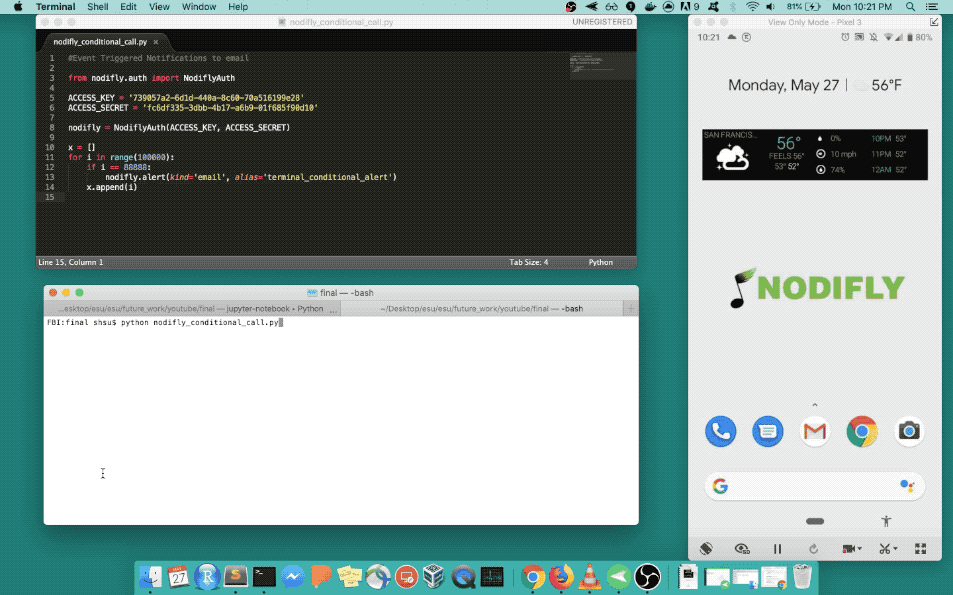
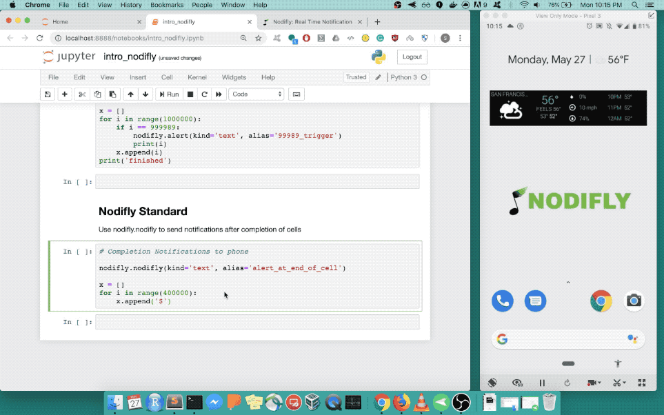

# Nodifly Python Library - Real Time Coding Notifications
==========================================================

Visit us at [nodifly.com](https://nodifly.com/)

You know the story - you run the code, head out for lunch, and come back hoping your code finished running without breaking. Nodifly ends this process of guessing and checking when the code finishes.

Nodifly is a no-frills, software as a service that can be used to notify users via email or text when the code has been completed, errored out, or met any user-defined conditions. Furthermore, Nodifly provides interactive dashboards to analyze slowdowns, breakdowns, and trends within the coding process.

## Installation

To install the current release: 

```
pip install --upgrade nodifly 
```

### Requirements 

- Python 2.7+ or Python 3.4+

## Usage and Starting Out

The library needs to be configured with your account's secret key which is available 
in your [Nodifly Settings](https://nodifly.com/logged_settings). 

After you register, grab your `Access Key` and `Access Secret` from the keys and tokens tab. 

First, you'll want to import Nodifly 

```
from nodifly.auth import NodiflyAuth
```

## Authentication 

Now, you can create a Nodifly instance with your access key and access secret. 

```
ACCESS_KEY = 'YOUR KEY HERE'
ACCESS_SECRET = 'YOUR SECRET HERE'

nodifly = NodiflyAuth(ACCESS_KEY, ACCESS_SECRET)
```

And then depending on if you're using terminal or in Jupyter notebooks, you can:

## Terminal 

After including the instantiated Nodifly instance at the top of the 

Within terminal you can call it as 

```
nodifly your_file.py - [text, record, email]
```



## Jupyter Notebooks 

Within Jupyter Notebooks, you can use it in a per cell use case.

```
#for cell completion notifications 

nodifly.nodifly(alias='YOUR_ALIAS', kind='text, record, email') #for completion

YOUR CODE HERE
```

OR 

```
#for conditional notifications

YOUR CODE HERE
	if [condition]:
		nodifly.alert(alias='YOUR_ALIAS', kind='text, record, email') #for conditional alerts
```



## Dashboards and Analysis


Access dynamically generated interative dashboards with information on all scripts, duration lengths, and temporal trends. 

## Questions and Comments 

We're actively looking to improve and expand Nodifly - if you have any questions or suggestions, please don't hesitate
to reach us at nodiflycontact@gmail.com 

Thank you!


